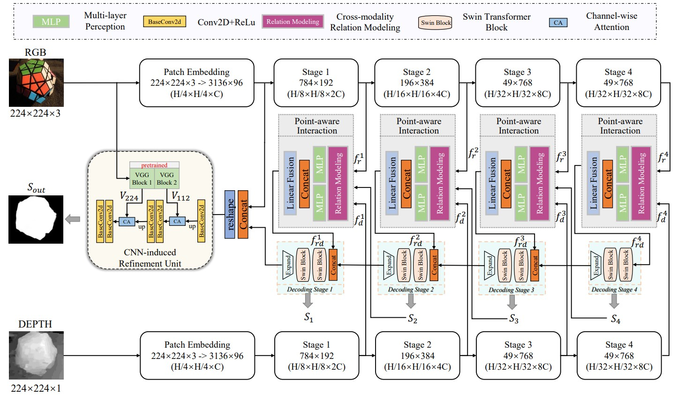
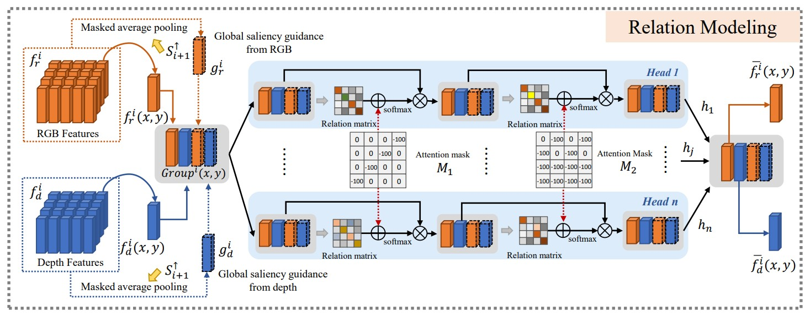
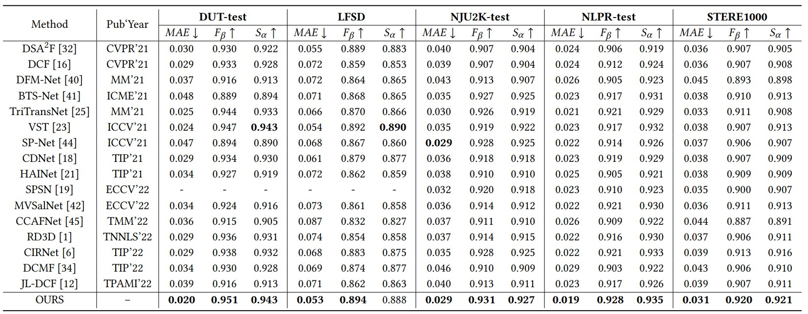

# PICR-Net_ACMMM2023

Runmin Cong, Hongyu Liu, Chen Zhang*, Wei Zhang, Feng Zheng, Ran Song, and Sam Kwong, Point-aware Interaction and CNN-induced Refinement Network for RGB-D salient object detection, ACM International Conference on Multimedia (ACM MM), 2023.
## Network

### Our overall framework：



### Relation Modeling




## Requirement

Pleasure configure the environment according to the given version:

- python 3.6.13
- torch 1.8.2
- torchvision 0.9.2
- opencv-python 4.6.0.66
- numpy 1.19.5
- timm 0.6.7
- einops 0.3.2
- tensorboardx 2.5.1

We also provide ".yaml" files for conda environment configuration, you can download it from [[Link]](https://pan.baidu.com/s/1ZMRy_k7FOtj7rkaUp8ArUQ?pwd=mvpl), code: mvpl, then use `conda env create -f requirement.yaml` to create a required environment.

## Data Preprocessing

Please follow the tips to download the processed datasets and pre-trained model:

Download RGB-D SOD dataset from [[Link](https://pan.baidu.com/s/1qq4tY-F0umOxEPgt8POBnQ?pwd=mvpl)], code: mvpl.

Download pretrained backbone weights from [[Link](https://pan.baidu.com/s/1WyogU9PTjtOBnE3vm8TPxA?pwd=mvpl)], code: mvpl.

```python
├── RGBD_dataset
    ├── train
        ├── RGB
        ├── depth
        ├── GT
    ├── val
        ├── RGB
        ├── depth
        ├── GT
    ├── test
        ├── NJU2K
            ├── RGB
            ├── depth
            ├── GT
        ├── NLPR
            ├── RGB
            ├── depth
            ├── GT
        ...

├── pretrain
    ├── swin_tiny_patch4_window7_224.pth
    ├── vgg16_bn-6c64b313.pth

```


## Training and Testing

**Training command** :

```python
python train.py
```


**Testing command** :

The trained model for PICR-Net can be download here: [[Link](https://pan.baidu.com/s/1vhHdfn91zMEXfrnYGuT_-g?pwd=mvpl)], code: mvpl.
```python
python test.py
```

## Evaluation
We implement three metrics: MAE (Mean Absolute Error), F-Measure, S-Measure.
We use Toolkit [[Link](https://github.com/zyjwuyan/SOD_Evaluation_Metrics)] to obtain the test metrics.
## Results

1. **Qualitative results**: we provide the saliency maps, you can download them from [[Link](https://pan.baidu.com/s/13k_3a8VPjJ0w5p86Iatwwg?pwd=mvpl)], code: mvpl.
2. **Quantitative results**: 




## Bibtex
```
   Coming soon...
```
## Contact Us
If you have any questions, please contact Runmin Cong at [rmcong@sdu.edu.cn](mailto:rmcong@sdu.edu.cn) or Hongyu Liu at [liu.hongyu@bjtu.edu.cn](mailto:liu.hongyu@bjtu.edu.cn).

